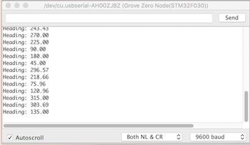

# Grove_3_Axis_Compass_V2.0(BMM150)
This is Arduino library for **Bosch BMM150** a Geomagnetic Sensor IC.

Key features
===

| IC Name | Interface | Votage Range | VDDIO Range | Magnetic Range                   | Magnetic Resolution |
| ------- | --------- | ------------ | ----------- | -------------------------------- | ------------------- |
| BMM150  | I2C       | 3.3V ~ 5.0V  | 1.2V ~ 3.6V | ±1300µT(x,y), ±2500μT(z)         | ~0.3μT              |

Usage
===

1. Taking an Arduino board, connect Grove_3_Axis_Compass_V2.0(BBM150) to the I2C port.
2. Open example/BMM150_Example/BMM150_Example.ino.
3. Compile and upload sketch.
4. Open Arduino serial monitor.

5. Do figure-8 calibration in 10 seconds while serial monitor echo dot symbol. The calibration period can be changed through the parameter timeout in **calibrate(uint16_t timeout)**.

6. Heading value is in range of 0º ~ 360º, this value is for Y axis, 0º means **Y** axis points at **North**, 180º means **Y** axis points at **South**.

***Figure-8 Calibration***

  

The figure-8 calibration is an easy way to get offset values of x/y/z axis.

For more infomation refer to [wiki page]().

------

This software is written by Lambor for Seeed Studio and is licensed under [The MIT License](http://opensource.org/licenses/mit-license.php). Check License.txt for more information. 

Contributing to this software is warmly welcomed. You can do this basically by 
[forking](https://help.github.com/articles/fork-a-repo), committing modifications and then [pulling requests](https://help.github.com/articles/using-pull-requests) (follow the links above 
for operating guide). Adding change log and your contact into file header is encouraged. 
Thanks for your contribution.

Seeed is a hardware innovation platform for makers to grow inspirations into differentiating products. By working closely with technology providers of all scale, Seeed provides accessible technologies with quality, speed and supply chain knowledge. When prototypes are ready to iterate, Seeed helps productize 1 to 1,000 pcs using in-house engineering, supply chain management and agile manufacture forces. Seeed also team up with incubators, Chinese tech ecosystem, investors and distribution channels to portal Maker startups beyond.